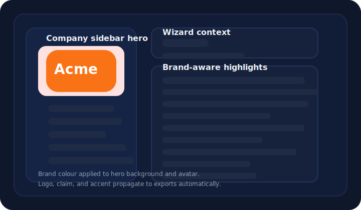

# Cognitive Staffing

**Cognitive Staffing** automates the extraction and enrichment of vacancy profiles from PDFs, URLs, or pasted text. It turns unstructured job ads into structured JSON, highlights missing data, and orchestrates multiple AI agents to draft follow-up questions, job ads, interview guides, and Boolean searches. By default, all LLM calls run through the OpenAI **Responses API** using cost-effective models: lightweight tasks run on `gpt-4.1-mini`, while reasoning-heavy flows (summaries, explanations, document rewrites) escalate to the Responses reasoning tier `o4-mini` with automatic fallbacks through `o3` and `gpt-4o`. This setup lets us enforce structured outputs, stream long generations, and fall back gracefully when rate limits occur. If needed, set the `USE_CLASSIC_API` environment variable to route all calls through the standard Chat Completions API instead.

## Version

- **EN:** Current release: **v1.1.0** (November 2025) – see below for highlights.
- **DE:** Aktuelle Version: **v1.1.0** (November 2025) – Highlights siehe unten.

## Unreleased

- **EN:** Closed the Interview Guide structured output schema by forcing
  `additionalProperties: false` on every object level and adding a
  regression test so the OpenAI Responses API accepts the format again.
  **DE:** Das Interview-Guide-Schema für strukturierte Ausgaben
  abgedichtet, indem `additionalProperties: false` auf allen
  Objekt-Ebenen erzwungen und ein Regressionstest ergänzt wurde, damit
  die OpenAI-Responses-API das Format wieder akzeptiert.
- **EN:** Replaced every `use_container_width` flag with the new
  `width` argument across Streamlit widgets to silence 2025 deprecation
  warnings and keep the layout stretching behaviour.
  **DE:** Sämtliche `use_container_width`-Schalter auf das neue
  `width`-Argument der Streamlit-Widgets umgestellt, um die
  angekündigten 2025-Deprecation-Warnungen zu entfernen und das
  Stretch-Layout beizubehalten.
- **EN:** Persisted onboarding source errors in `st.session_state` so the
  localized Streamlit `st.error` message remains visible until a new URL
  or upload succeeds, eliminating the blink between attempts.
  **DE:** Onboarding-Importfehler bleiben jetzt in `st.session_state`
  gespeichert, sodass die lokalisierte `st.error`-Meldung sichtbar
  bleibt, bis eine neue URL oder ein Upload funktioniert – ohne
  flackernde Hinweise zwischen den Versuchen.
- **EN:** Retired the last Wizard v1 scaffolding – removed the unused
  `wizard_state['feature']` bootstrap and the deprecated
  `core.schema` aliases/`coerce_and_fill_wizard` helper now that the
  `SCHEMA_WIZARD_V1` flag is gone for good, and added a regression test
  that fails if those legacy strings reappear in Python sources.
  **DE:** Letzte Wizard-v1-Stützen entfernt – der ungenutzte
  `wizard_state['feature']`-Bootstrap sowie die veralteten
  `core.schema`-Aliasse bzw. der `coerce_and_fill_wizard`-Helper sind nach dem endgültigen Aus für `SCHEMA_WIZARD_V1` gelöscht; zusätzlich prüft ein
  Regressionstest, dass diese Legacy-Strings nicht zurückkehren.
- **EN:** Locked all OpenTelemetry packages to version 1.26.0 and routed
  optional ingestion extras through `pyproject.toml` so deployments stop
  drifting across manifests.
  **DE:** Alle OpenTelemetry-Pakete auf Version 1.26.0 fixiert und die
  optionalen Ingestion-Abhängigkeiten in `pyproject.toml` verankert, damit
  Deployments nicht länger auseinanderlaufen.
- **EN:** Refined the Streamlit UI with a branded hero banner, reorganised the
  summary into "Profile overview", "Insights", and "Export" tabs, added an
  interactive Plotly salary range visual, and introduced an ESCO-backed skill
  explorer with cached descriptions.
  **DE:** Die Streamlit-Oberfläche mit einem gebrandeten Hero-Banner,
  zusammengefassten Tabs („Profilübersicht“, „Insights“, „Export“), einer
  interaktiven Plotly-Gehaltsspanne und einem ESCO-gestützten
  Skill-Explorer samt Cache für Beschreibungen modernisiert.
- **EN:** Extended the Need Analysis schema with dedicated `department.*` and
  `team.*` sections, a customer-facing flag under `position.*`, and new
  requirement switches for background, reference, and portfolio checks. The
  Team & Context step, follow-up navigation, and field-to-section mapping now
  reflect the eight-step wizard, and the schema propagation script updates the
  generated assets automatically.
  **DE:** Das Need-Analysis-Schema um eigene `department.*`- und
  `team.*`-Abschnitte sowie einen Kundenkontakt-Schalter in `position.*` und
  neue Pflichtfelder für Background-, Referenz- und Portfolio-Prüfungen
  erweitert. Der Schritt „Team & Kontext“, die Folgefragen-Navigation und die
  Feld-zu-Sektions-Zuordnung bilden den Acht-Schritte-Wizard jetzt korrekt ab,
  und das Schema-Propagation-Skript aktualisiert die generierten Artefakte
  automatisch.
- **EN:** Reimagined the onboarding entry step with a bilingual five-line
  guidance block that highlights OpenAI/ESCO data capture, centres the URL and
  upload inputs at equal width, removes the manual text field, and replaces the
  green gradient CTA with a compact continue button.
  **DE:** Den Onboarding-Einstieg neu gestaltet: Fünf zweisprachige
  Guidance-Zeilen betonen OpenAI-/ESCO-Datenerfassung, URL- und Upload-Felder
  stehen mittig in gleicher Breite, das manuelle Textfeld entfällt und der
  grüne Gradient-CTA weicht einem kompakten Weiter-Button.
- **EN:** The onboarding URL/upload inputs and continue button now stay
  disabled (with a bilingual lock hint) until an OpenAI API key is configured,
  preventing accidental uploads when AI ingestion is offline.
  **DE:** URL-/Upload-Felder sowie der Weiter-Button im Onboarding bleiben
  (inklusive zweisprachigem Hinweis) deaktiviert, bis ein OpenAI-API-Schlüssel
  hinterlegt ist, damit keine versehentlichen Uploads ohne KI-Analyse erfolgen.
- **EN:** Removed the final references to the deprecated `wizard._legacy`
  runner so navigation always goes through `WizardRouter` and the modern
  Streamlit step callbacks.
  **DE:** Letzte Verweise auf den veralteten `wizard._legacy`-Runner entfernt –
  die Navigation läuft nun ausschließlich über den `WizardRouter` und die
  aktuellen Streamlit-Step-Callbacks.
- **EN:** Harmonised code style across the LLM prompts and legacy wizard modules:
  snake_case helpers and explicit type hints keep linting consistent with the
  repo-wide PEP 8 and typing policy.
  **DE:** Den Code-Style in LLM-Prompts und Legacy-Wizard-Modulen vereinheitlicht:
  snake_case-Helfer und explizite Typannotationen stellen die PEP-8-/Typing-
  Vorgaben im gesamten Repo sicher.
- **EN:** Finalised the wizard navigation: the eight Streamlit pages now follow
  the file order `01_jobad.py` → `08_summary.py`, all legacy step-order flags
  have been removed, and the step-order router runs by default after deleting
  the legacy runner.
  **DE:** Die Wizard-Navigation ist finalisiert: Die acht Streamlit-Seiten
  folgen der Dateireihenfolge `01_jobad.py` → `08_summary.py`, sämtliche
  veralteten Step-Order-Schalter wurden entfernt und der Step-Order-Router
  ersetzt den Legacy-Flow vollständig.
- **EN:** Clarified the supported Python range (`>=3.11,<4.0`) so Streamlit
  deployments avoid attempting Python 4 previews that break dependencies like
  `backoff`.
  **DE:** Unterstützten Python-Bereich (`>=3.11,<4.0`) präzisiert, damit
  Streamlit-Deployments keine Python-4-Previews wählen, die Abhängigkeiten wie
  `backoff` beschädigen.
- **EN:** Relaxed the OpenAI SDK pin to accept the 2.x releases shipped on
  Streamlit Cloud, removing the deployment blocker caused by the older
  constraint.
  **DE:** Die OpenAI-SDK-Version auf die 2.x-Releases erweitert, wie sie auf
  Streamlit Cloud bereitstehen, und damit den Deploy-Blocker durch die ältere
  Einschränkung aufgehoben.
- **EN:** Chip-based multiselects now show context-specific bilingual hints
  (e.g. “Add more benefits…”), allowing each wizard section to guide the
  entries users add.
  **DE:** Chip-Multiselects zeigen jetzt kontextspezifische zweisprachige
  Hinweise (z. B. „Weitere Benefits hinzufügen…“) und führen Nutzer:innen
  gezielt durch neue Einträge.
- **EN:** The wizard’s first step now opens with a tabbed extraction review,
  letting you edit company, role, logistics, requirements, and process data in
  place, while an interactive eight-step progress tracker highlights completion
  per section. Follow-up questions gained chip-styled suggestions, field-aware
  widgets (checkboxes, number/date inputs, list editors), and the company logo
  uploader automatically derives the dominant brand colour for
  `company.brand_color`.
  **DE:** Der erste Wizard-Schritt startet jetzt mit einer tab-basierten
  Extraktionsübersicht, in der Unternehmens-, Rollen-, Logistik-,
  Anforderungs- und Prozessdaten direkt bearbeitet werden können. Ein
  interaktiver Acht-Schritte-Fortschrittsindikator zeigt den Erfüllungsgrad pro
  Abschnitt. Anschlussfragen bieten Chip-Vorschläge, feldspezifische Widgets
  (Checkboxen, Zahlen-/Datumsfelder, Listeneditoren) und der Logo-Upload
  ermittelt automatisch die dominierende Markenfarbe für
  `company.brand_color`.
- **EN:** Replaced all ACME/example.com wizard placeholders with bilingual
  guidance and reset the Recruiting Wizard defaults to empty values that flag
  required fields instead of injecting sample companies.
  **DE:** Sämtliche ACME- bzw. example.com-Platzhalter im Wizard durch
  zweisprachige Hinweise ersetzt und die Recruiting-Wizard-Defaults auf leere
  Werte mit Pflichtfeld-Markierungen zurückgesetzt statt Demo-Unternehmen
  einzutragen.
- **EN:** Unified the schema layer: `NeedAnalysisProfile` now drives ingestion,
  wizard bindings, exports, and tests using the canonical dot-paths defined in
  `constants/keys.py::ProfilePaths`.
  **DE:** Die Schema-Schicht ist vereinheitlicht: `NeedAnalysisProfile`
  steuert Ingestion, Wizard-Bindings, Exporte und Tests über die kanonischen
  Dot-Pfade aus `constants/keys.py::ProfilePaths`.
- **EN:** Added a bilingual repository structure overview so new contributors
  can map directories like `pages/`, `wizard/`, and `core/` quickly.
  **DE:** Eine zweisprachige Übersicht über die Projektstruktur ergänzt, damit
  neue Contributor:innen Verzeichnisse wie `pages/`, `wizard/` und `core/`
  schneller zuordnen können.
- **EN:** CI now enforces a minimum 88% coverage, uploads XML/HTML reports, and keeps `llm`-tagged pytest cases opt-in to guard heuristics without blocking offline contributors.
  **DE:** Die CI erzwingt jetzt mindestens 88 % Testabdeckung, lädt XML-/HTML-Berichte hoch und behandelt `llm`-markierte Pytest-Cases optional, damit Heuristiken geschützt bleiben und Offline-Contributor:innen weiterarbeiten können.
- **EN:** Introduced the Aurora Fjord palette across both themes and the skill board, combining midnight blues with glacial aqua and ember highlights for calmer hierarchy and reliable contrast.
  **DE:** Die neue Aurora-Fjord-Palette in Dark- und Light-Theme sowie dem Skill-Board verankert – Mitternachtsblau trifft auf Gletscher-Aqua und Amber-Akzente für ruhigere Hierarchien und verlässlichen Kontrast.
- **EN:** Hardened optional profile URL sanitisation so canonicalisation and wizard updates trim blanks to `None`, preventing schema resets.
  **DE:** Optionale Profil-URLs weiter gehärtet: Kanonisierung und Wizard-Updates kürzen leere Werte jetzt auf `None`, sodass keine Schema-Resets mehr ausgelöst werden.
- **EN:** Streamlined dependency management so `pyproject.toml` is the single
  source of truth, deleted the legacy `requirements.txt`, and updated
  deployment tooling to run `pip install .` or `pip install .[dev]`.
  **DE:** Die Abhängigkeitsverwaltung gestrafft: `pyproject.toml` ist die
  einzige Quelle, das alte `requirements.txt` wurde entfernt und Deploy-Tools
  nutzen jetzt `pip install .` bzw. `pip install .[dev]`.
- **EN:** Trimmed the default dependency stack to the core Streamlit app requirements and exposed OCR/spaCy tooling via the `ingest` optional extra (`pip install .[ingest]`) for leaner installs.
  **DE:** Die Standard-Abhängigkeiten auf die zentralen Streamlit-Komponenten reduziert und OCR-/spaCy-Tools über das optionale Extra `ingest` (`pip install .[ingest]`) bereitgestellt, um Installationen schlanker zu halten.
- **EN:** Added `PyMuPDF` to the core requirements so PDF-based interview guide exports work out of the box on clean deployments.
  **DE:** `PyMuPDF` zu den Kern-Requirements ergänzt, damit PDF-Interview-Guides auf frischen Deployments ohne Zusatzschritte funktionieren.
- **EN:** Updated the skill market fallback caption to state that no benchmarks are available and invite users to capture skill data instead of displaying neutral placeholder numbers.
  **DE:** Die Skill-Markt-Fallback-Beschriftung aktualisiert: Sie weist jetzt auf fehlende Benchmarks hin und bittet um das Erfassen von Skill-Daten, statt neutrale Platzhalterzahlen anzuzeigen.
- **EN:** Relocated the “Benefit ideas” module from the sidebar into the Rewards & Benefits step and surfaced the step summary directly above each header.
  **DE:** Das Modul „Benefit-Ideen“ aus der Sidebar in den Schritt „Leistungen & Benefits“ verschoben und die Schrittübersicht direkt über jeder Überschrift platziert.
- **EN:** Refined the Summary step with a dedicated "Create a job ad" section, a compact field selector, and a collapsible preferences block while moving the internal-process review back into the Process step.
  **DE:** Den Summary-Schritt überarbeitet: Eigener Bereich „Stellenanzeige erstellen“ mit kompakter Feldauswahl und einklappbaren Präferenzen, die Übersicht zu „Interne Prozesse definieren“ steckt nun im Prozess-Schritt.

## Testing / Tests

- **EN:** Run `ruff format`, `ruff check`, and `mypy --config-file pyproject.toml` before executing `coverage run -m pytest -q` (the default marker expression skips `llm` tests; add `-m llm` when an OpenAI key is configured). Keep total coverage ≥88% so CI stays green and XML/HTML artifacts remain available for review.
- **DE:** Führe `ruff format`, `ruff check` und `mypy --config-file pyproject.toml` aus und starte anschließend `coverage run -m pytest -q` (standardmäßig werden `llm`-Tests übersprungen; mit konfiguriertem OpenAI-Key kannst du `-m llm` ergänzen). Halte die Gesamtabdeckung bei ≥88 %, damit die CI grün bleibt und XML-/HTML-Artefakte für das Review bereitstehen.
- **EN:** Track pre-existing typing gaps and the temporary ignore list in `docs/mypy_typing_status.md` so future branches can retire overrides incrementally.
- **DE:** Dokumentierte Typing-Lücken sowie die temporären Ignore-Listen findest du in `docs/mypy_typing_status.md`, damit zukünftige Branches die Overrides schrittweise abbauen können.
- **EN:** Heavy optional dependencies such as `streamlit`, `requests`, and `bs4` are configured with `follow_imports = "skip"` so the type checker can focus on first-party fixes; replace skips with typed facades when the upstream packages ship stubs.
- **DE:** Schwere optionale Abhängigkeiten wie `streamlit`, `requests` und `bs4` laufen mit `follow_imports = "skip"`, damit sich der Type-Checker auf First-Party-Bereiche konzentrieren kann; ersetze die Skips durch typisierte Fassaden, sobald die Upstream-Pakete Stubs liefern.
- **EN:** Wizard helper modules (`wizard._agents`, `_logic`, `_openai_bridge`, `interview_step`, `wizard`) now require typed function signatures via `disallow_untyped_defs`; keep annotations complete when editing these files.
- **DE:** Die Wizard-Hilfsmodule (`wizard._agents`, `_logic`, `_openai_bridge`, `interview_step`, `wizard`) erzwingen `disallow_untyped_defs`; achte bei Änderungen auf vollständige Typannotationen.
- **EN:** Smoke tests cover every wizard page metadata file plus the `wizard_tools` agent shims. Run `pytest tests/test_wizard_pages_smoke.py tests/test_wizard_tools_*.py` when touching navigation metadata or tool fallbacks.
- **DE:** Smoke-Tests decken alle Wizard-Seiten-Metadaten sowie die `wizard_tools`-Agenten ab. Führe `pytest tests/test_wizard_pages_smoke.py tests/test_wizard_tools_*.py` aus, sobald Navigation-Metadaten oder Tool-Fallbacks geändert werden.

## What's new in v1.1.0 / Neu in v1.1.0

- **EN:** Salary estimates now key off the job title, core responsibilities, must-have and nice-to-have requirements, tools/tech/certificates, language expectations, industry, and the provided city hint, and the default Streamlit navigation no longer shows the redundant overview entry.
  **DE:** Gehaltsschätzungen orientieren sich jetzt an Jobtitel, Kernaufgaben, Muss- und Nice-to-have-Anforderungen, Tools/Technologien/Zertifikaten, Sprachvorgaben, Branche sowie der angegebenen Stadt; die Standard-Navigation von Streamlit blendet den überflüssigen Überblick-Eintrag aus.
- **EN:** Streamlined the sidebar: navigation links are gone, language and dark-mode switches sit beneath each other with flag icons, and salary estimates now launch automatically once job title plus a location hint are present, listing required fields, summarising the top five drivers in a single sentence, and surfacing the raw calculation details.
  **DE:** Sidebar verschlankt: Navigations-Links entfernt, Sprach- und Dark-Mode-Umschalter stehen untereinander mit Flaggen-Icons, und Gehaltsschätzungen starten automatisch, sobald Jobtitel und ein Standorthinweis vorliegen – inklusive Pflichtfeldliste, Ein-Satz-Zusammenfassung der fünf wichtigsten Faktoren und sichtbarer Berechnungsdetails.
- **EN:** Normalise wizard widget defaults via `_ensure_widget_state()` so text inputs and list editors seed before rendering, avoiding Streamlit "Cannot set widget" errors on reruns.
  **DE:** Normalisiert die Widget-Defaults im Wizard über `_ensure_widget_state()`, damit Textfelder und Listen-Editoren vor dem Rendern initialisiert werden und beim erneuten Ausführen keine "Cannot set widget"-Fehler mehr auftreten.
- **EN:** Clean up company contact phones and websites across the wizard so noisy entries are normalised and cleared fields store `None` in the profile.
  **DE:** Bereinigt Unternehmens-Telefonnummern und Websites im Wizard, normalisiert unruhige Eingaben und speichert geleerte Felder als `None` im Profil.
- **EN:** Disable all AI suggestion buttons and generation actions when no OpenAI API key is configured, displaying a bilingual lock hint instead of triggering backend calls.
  **DE:** Deaktiviert sämtliche KI-Vorschlagsbuttons und Generierungsaktionen, sobald kein OpenAI-API-Schlüssel hinterlegt ist, und zeigt stattdessen einen zweisprachigen Hinweis an.
- **EN:** Unified Responses API retry handling now logs warnings and automatically falls back to chat completions or static content when structured calls fail or return invalid JSON.
  **DE:** Vereinheitlichte Responses-Retry-Logik protokolliert Warnungen und schaltet automatisch auf Chat-Completions oder statische Inhalte um, wenn strukturierte Aufrufe scheitern oder ungültiges JSON liefern.
- **EN:** Enforced full NeedAnalysisProfile ↔ wizard alignment: every schema field now has a canonical `ProfilePaths` entry, appears in the wizard panels, and propagates into exports with regression tests guarding drift.
  **DE:** Vollständige NeedAnalysisProfile↔Wizard-Ausrichtung umgesetzt: Jedes Schemafeld besitzt nun einen kanonischen `ProfilePaths`-Eintrag, wird in den Wizard-Panels angezeigt und in Exporte übernommen, abgesichert durch Regressionstests gegen Abweichungen.
- **EN:** Refined the salary sidebar: the panel now highlights the latest estimate with its source, charts top factors via Plotly, and falls back to curated benefit shortlists whenever the AI returns no suggestions.
  **DE:** Salary-Sidebar überarbeitet: Die Ansicht zeigt nun die aktuelle Schätzung samt Quelle, visualisiert die wichtigsten Einflussfaktoren mit Plotly und blendet bei ausbleibenden KI-Vorschlägen automatisch die kuratierte Benefit-Shortlist ein.
- **EN:** Sidebar branding overrides let you upload a logo, pick a brand colour, and edit the claim; exports and job ads now embed that metadata by default.
  **DE:** Branding-Overrides in der Sidebar ermöglichen Logo-Uploads, die Auswahl der Markenfarbe und das Bearbeiten des Claims; Exporte und Stellenanzeigen übernehmen diese Metadaten automatisch.

## Branding Integration / Branding-Integration

**EN:** The wizard now recognises employer branding assets automatically. When a career page URL is provided, Cognitive Staffing detects the company logo, dominant brand colour, and slogan, then applies them to the sidebar hero, exports, and downstream JSON (`company.logo_url`, `company.brand_color`, `company.claim`). The screenshot below shows an example sidebar that picked up a logo and tone-on-tone accent colour without any manual configuration.

**DE:** Der Wizard erkennt Employer-Branding-Assets jetzt automatisch. Sobald eine Karriereseiten-URL vorliegt, ermittelt Cognitive Staffing Logo, Hauptfarbe und Claim des Unternehmens und übernimmt sie in die Sidebar, Exporte sowie das JSON (`company.logo_url`, `company.brand_color`, `company.claim`). Der Screenshot unten zeigt eine Sidebar, die Logo und Akzentfarbe ohne manuelle Einstellungen übernommen hat.

**EN:** If detection misses assets you can open the sidebar branding settings to upload a logo or choose a fallback colour. The job-ad generator now feeds the slogan and brand colour into its prompt metadata and Markdown fallback, ensuring downstream exports keep the employer voice.

**DE:** Falls die Erkennung keine Assets findet, kannst du in den Branding-Einstellungen der Sidebar ein Logo hochladen oder eine Ersatzfarbe wählen. Die Stellenanzeigengenerierung übergibt Claim und Markenfarbe an Prompt-Metadaten und Markdown-Fallback, damit Exporte den Arbeitgeberton zuverlässig mitführen.

> **Limitations / Einschränkungen**
>
> **EN:** Branding detection currently targets public websites. Private portals or PDF-only uploads fall back to the default Cognitive Staffing theme.
>
> **DE:** Die Branding-Erkennung funktioniert derzeit für öffentliche Websites. Private Portale oder reine PDF-Uploads nutzen weiterhin das Standard-Theme.

**EN:** When no brand assets are available the sidebar now surfaces a prominent "Set branding" call-to-action instead of showing placeholder slogans or demo logos.
**DE:** Liegen keine Brand-Assets vor, blendet die Sidebar jetzt einen gut sichtbaren „Branding setzen“-Hinweis ein und verzichtet auf Beispiel-Claims oder Demo-Logos.

## What's new in v1.0.0 / Neu in v1.0.0
- **Wizard overhaul & schema alignment:**  
  **EN:** Every wizard step now shares a consistent header/subheader/intro layout that maps one-to-one to the `NeedAnalysisProfile` schema, ensuring exports remain perfectly synced.  
  **DE:** Alle Wizard-Schritte nutzen jetzt ein einheitliches Header-/Subheader-/Intro-Layout mit direkter 1:1-Abbildung auf das `NeedAnalysisProfile`-Schema, sodass Exporte lückenlos synchron bleiben.
- **Multi-tone guidance for each step:**  
  **EN:** New pragmatic, formal, and casual intro texts (EN/DE) explain what to capture on every step and adapt automatically to the selected language.  
  **DE:** Neue pragmatische, formelle und lockere Intro-Texte (DE/EN) erläutern pro Schritt, welche Angaben benötigt werden, und passen sich automatisch der gewählten Sprache an.
- **Expanded AI assistance:**  
  **EN:** Skills, benefits, and responsibilities now feature refreshed AI/ESCO suggestion buttons with better error handling, while the interview step generates full guides with graceful fallbacks.  
  **DE:** Skills, Benefits und Verantwortlichkeiten erhalten aktualisierte KI-/ESCO-Vorschlagsbuttons mit robuster Fehlerbehandlung, und der Interview-Schritt erzeugt komplette Leitfäden inklusive Fallbacks.
- **Design system & mobile polish:**  
  **EN:** Light/dark themes share one design token set with improved spacing, focus states, and responsive navigation for mobile recruiters.  
  **DE:** Light-/Dark-Themes greifen auf einen gemeinsamen Design-Token-Pool mit optimierten Abständen, Fokuszuständen und responsiver Navigation für mobile Recruiter:innen zurück.

## Feature Highlights
- **Structured extraction:** JSON schemas and Pydantic validation keep 20+ vacancy fields aligned with the `NeedAnalysisProfile` model. LangChain’s `StructuredOutputParser` and `PydanticOutputParser` are now used to embed format instructions directly into prompts and to coerce responses back into the model, reducing brittle parsing code. Locked fields such as **job_title** or **company** are auto-filled when rule matches fire and remain protected until explicitly unlocked.
- **Interactive follow-ups:** A Follow-up Question Generator agent produces prioritized follow-up questions with suggestion chips. When ESCO metadata is available, the assistant injects normalized essential skills into its prompts, and an auto re-ask loop will keep rerunning critical questions until every must-have field is answered.
- **ESCO integration:** When enabled, the ESCO enricher normalizes job titles, proposes essential skills, and flags missing competencies directly in the UI.
- **AI-assisted suggestions:** Dedicated helper agents surface responsibilities, skills, benefits, boolean strings, interview guides, and polished job ads. Responses stream live by default so the UI remains responsive during longer generations. The requirements, role, and compensation steps now include on-demand “Suggest responsibilities”, “Suggest additional skills”, and “Suggest benefits” actions that take into account existing inputs to avoid duplicates.
- **Step intros & captions / Schritt-Intros & Hinweise:**  
  **EN:** Each wizard page opens with a localized introductory caption (in the chosen tone) so teams immediately know which details matter most on that step.  
  **DE:** Jede Wizard-Seite startet mit einer lokalisierten Einleitung im gewählten Tonfall, damit Teams sofort wissen, welche Angaben auf diesem Schritt entscheidend sind.
- **Guided wizard sections / Geführte Wizard-Abschnitte:**
  **EN:** Steps are grouped into Onboarding, Q&A, Company, Team & Structure, Role & Tasks, Skills & Requirements, Compensation, Hiring Process, and Summary, so recruiters can follow a consistent flow with inline help for each section. The dedicated Q&A step collects generated follow-up questions with interactive inputs right after the extraction overview.
  **DE:** Schritte sind in Onboarding, Q&A, Unternehmen, Team & Struktur, Rolle & Aufgaben, Skills & Anforderungen, Vergütung, Prozess und Zusammenfassung gegliedert, damit Recruiter:innen einem einheitlichen Ablauf mit Inline-Hilfen pro Abschnitt folgen können. Der neue Q&A-Schritt bündelt die generierten Anschlussfragen direkt nach der Extraktion und stellt interaktive Eingabefelder bereit.
- **Tone control / Tonalitätssteuerung:**  
  **EN:** Choose between concise, professional, or casual writing styles before generating job ads, interview guides, or follow-up emails.  
  **DE:** Wähle vor der Generierung von Stellenanzeigen, Interview-Guides oder Follow-up-E-Mails zwischen einem prägnanten, professionellen oder lockeren Schreibstil.
- **Automatic company research / Automatische Unternehmensrecherche:**  
  **EN:** After uploading a job ad, the wizard fetches the company’s mission, culture, and approximate size from the web to pre-fill the company section.  
  **DE:** Nach dem Upload einer Stellenanzeige ruft der Wizard Mission, Kultur und ungefähre Unternehmensgröße aus dem Web ab und füllt den Unternehmensbereich damit vor.
- **Normalization & JSON repair / Normalisierung & JSON-Reparatur:**  
  **EN:** A repository-wide normalization pipeline trims noise, harmonizes gender-specific terms and locations, uppercases country codes, and automatically repairs malformed profile JSON via the OpenAI Responses API if validation fails.  
  **DE:** Eine Repository-weite Normalisierung entfernt Rauschen, bereinigt Gender-Zusätze und Ortsangaben, wandelt Ländercodes in Großbuchstaben und repariert ungültiges Profil-JSON bei Validierungsfehlern automatisch über die OpenAI-Responses-API.
- **Branding auto-detect / Branding-Autoerkennung:**  
  **EN:** Brand assets (logo, favicon, dominant color, and company claim) are scraped from provided career page URLs, cached, and injected into the wizard’s sidebar, exports, and editing forms.  
  **DE:** Branding-Assets (Logo, Favicon, dominante Farbe und Unternehmensclaim) werden von angegebenen Karriereseiten extrahiert, zwischengespeichert und im Wizard-Sidebar, in Exporten und in den Eingabemasken angezeigt.
- **Analysis helpers / Analyse-Helfer:**
  **EN:** Deterministic helper tools provide salary benchmarks, currency conversion with cached FX rates, and ISO date normalization, allowing the assistant to ground certain reasoning steps without extra API calls.
  **DE:** Deterministische Helfer liefern Gehalts-Benchmarks, Währungsumrechnung mit zwischengespeicherten FX-Kursen und ISO-Datumsnormalisierung, sodass der Assistent ohne zusätzliche APIs fundierte Herleitungen vornehmen kann.
- **Suggestion failover / Vorschlags-Failover:**
  **EN:** If the OpenAI Responses endpoint is unavailable or `USE_CLASSIC_API=1`, skill and benefit suggestions automatically fall back to the classic Chat Completions backend; persistent failures return curated static benefit shortlists so the UI never blocks.
  **DE:** Fällt der OpenAI-Responses-Endpunkt aus oder ist `USE_CLASSIC_API=1` gesetzt, weichen Skill- und Benefit-Vorschläge automatisch auf die klassische Chat-Completions-API aus; bei dauerhaften Fehlern liefern kuratierte statische Benefit-Shortlists weiterhin nutzbare Ergebnisse.
- **Vector-store enrichment:** If you set a `VECTOR_STORE_ID`, the RAG agent will retrieve supporting snippets via OpenAI **file_search**, yielding better suggestions when the uploaded job ad is sparse on details.
- **Extraction cache / Extraktions-Cache:**
  **EN:** Re-uploading the same vacancy now reuses the cached structured extraction via `st.cache_data`, keyed by the normalized text, locked fields, and reasoning mode to avoid duplicate LLM costs.
  **DE:** Beim erneuten Hochladen derselben Ausschreibung greift die strukturierte Extraktion auf einen `st.cache_data`-Cache zurück, der Text, gesperrte Felder und Reasoning-Modus berücksichtigt – doppelte LLM-Kosten entfallen.
- **Parallel RAG lookups / Parallele RAG-Abfragen:**
  **EN:** When a vector store is configured the field-specific file_search calls execute concurrently, so chunk retrieval completes faster even for larger schemas.
  **DE:** Ist ein Vector-Store hinterlegt, laufen die feldspezifischen file_search-Aufrufe parallel, wodurch die Snippet-Recherche auch bei umfangreichen Schemata schneller abgeschlossen ist.
- **Multi-model routing / Modellrouting:**
  **EN:** The router now prefers `gpt-4.1-mini` for lightweight lookups and automatically escalates summaries, explanations, and planning flows to `o4-mini`, cascading through `o3`, `gpt-4o-mini`, and `gpt-4o` if capacity constraints occur. Administrators can still override the model via configuration (for example by setting `OPENAI_MODEL`), but automated selection is the default.
  **DE:** Der Router nutzt standardmäßig `gpt-4.1-mini` für leichte Abfragen und hebt Zusammenfassungen, Erklärungen und Planungen auf `o4-mini`, inklusive Fallbacks über `o3`, `gpt-4o-mini` und `gpt-4o`, sobald Kapazitätsprobleme auftreten. Administratoren können per Konfiguration (z. B. mit `OPENAI_MODEL`) weiterhin ein bestimmtes Modell fest vorgeben, aber normalerweise erfolgt die Modellauswahl automatisch.
- **Gap analysis workspace / Gap-Analyse-Arbeitsbereich:**  
  **EN:** Launch the **Gap analysis** view to combine ESCO metadata, retrieved snippets, and vacancy text into an executive-ready report that highlights missing information and next steps.  
  **DE:** Öffne die Ansicht **Gap-Analyse**, um ESCO-Metadaten, gefundene Snippets und Ausschreibungstext zu einem Management-tauglichen Bericht zu kombinieren, der fehlende Informationen und nächste Schritte hervorhebt.

## Model Routing & Cost Controls / Modellrouting & Kostensteuerung

- **Content cost router / Kostenrouter für Inhalte**
  **EN:** Each request runs through a prompt cost router that inspects the token length and content before selecting the cheapest suitable tier. Lightweight prompts execute on `gpt-4.1-mini`, while tasks requiring deeper reasoning automatically escalate to `o4-mini`. When quality risks remain high the chain continues through `o3`, `gpt-4o-mini`, and `gpt-4o`. Power users can still force a specific tier when necessary.
  **DE:** Jede Anfrage durchläuft einen Kostenrouter, der Tokenlänge und Inhalt prüft, bevor das günstigste passende Modell gewählt wird. Leichte Prompts laufen auf `gpt-4.1-mini`, während Aufgaben mit höherem Reasoning-Bedarf automatisch auf `o4-mini` eskalieren. Bleiben Qualitätsrisiken bestehen, führt die Kette weiter über `o3`, `gpt-4o-mini` und `gpt-4o`. Bei Bedarf lässt sich weiterhin gezielt eine bestimmte Modellstufe erzwingen.
- **Quick vs Precise toggle / Schnell- vs. Präzisionsmodus**
  **EN:** The settings sidebar exposes a bilingual toggle to choose between the cost-efficient quick mode (minimal reasoning on `gpt-4.1-mini`, low verbosity) and the high-accuracy precise mode (`o4-mini`, high verbosity). Switching modes rewires model routing and reasoning effort automatically.
  **DE:** In den Einstellungen gibt es nun einen zweisprachigen Schalter für den Schnellmodus (minimaler Denkaufwand auf `gpt-4.1-mini`, niedrige Ausführlichkeit) bzw. den Präzisionsmodus (`o4-mini`, hohe Ausführlichkeit). Der Wechsel passt Modellrouting und Reasoning-Aufwand automatisch an.
- **Fallback chain (o4 mini → o3 → GPT-4.1 nano → GPT-4o → GPT-4 → GPT-3.5) / Fallback-Kette (o4 mini → o3 → GPT-4.1 nano → GPT-4o → GPT-4 → GPT-3.5)**
  **EN:** When the primary model is overloaded or deprecated, the platform retries with the chain `o4-mini → o3 → gpt-4.1-nano → gpt-4o → gpt-4 → gpt-3.5-turbo`. Each downgrade is recorded in telemetry so we can spot chronic outages.
  **DE:** Meldet die API, dass das Primärmodell überlastet oder abgekündigt ist, greift jetzt der Fallback-Pfad `o4-mini → o3 → gpt-4.1-nano → gpt-4o → gpt-4 → gpt-3.5-turbo`. Jeder Herunterstufungsversuch wird im Telemetrie-Stream protokolliert, um dauerhafte Störungen erkennbar zu machen.
- **Model override via configuration / Modell-Override über Konfiguration**
  **EN:** Use environment variables or secrets (e.g., set `OPENAI_MODEL` or `st.session_state["model_override"]`) to pin a specific model tier if necessary. Clearing the override restores automatic cost-based routing and the normal fallback chain.
  **DE:** Setze bei Bedarf Umgebungsvariablen oder Secrets (z. B. `OPENAI_MODEL` oder `st.session_state["model_override"]`), um ein bestimmtes Modell fest vorzugeben. Ohne Override greift wieder das automatische, kostenbasierte Routing inklusive Fallback-Kette.

## LLM configuration & fallbacks / LLM-Konfiguration & Fallbacks

**EN:**

- `USE_RESPONSES_API` (default `1`) routes all structured calls through the OpenAI Responses API with enforced JSON schemas and tool support. Setting this flag to `0` (or `False`) automatically toggles `USE_CLASSIC_API=1` so every request uses the Chat Completions client instead.
- `USE_CLASSIC_API=1` forces the legacy chat backend even when Responses would normally be selected. Both suggestion and extraction pipelines retry on Responses errors first, then cascade to chat, and finally fall back to curated static copy (for example, benefit shortlists) if the API keeps failing.
- `RESPONSES_ALLOW_TOOLS` (default `0`) re-enables function/tool payloads on the Responses API. Keep the default for the 2025 Responses rollout where tool calls are blocked; set the flag to `1` only if your account is allowlisted for tool-enabled Responses. Otherwise the client automatically drops to the classic chat backend whenever tools are required.
- When no `OPENAI_API_KEY` is configured the UI disables all AI buttons and shows a bilingual lock banner. Providing the key via environment variables or Streamlit secrets re-enables the features immediately.
- `REASONING_EFFORT` pairs with the quick/precise toggle: quick mode enforces `minimal` reasoning on `gpt-4.1-mini`, precise mode upgrades to `high` effort on `o4-mini`, and manual overrides still cascade through the fallback chain when required.
- `COGNITIVE_PREFERRED_MODEL` and `COGNITIVE_MODEL_FALLBACKS` let operators influence the router order (preferred model first, followed by comma-separated fallbacks) without code changes; legacy alias values resolve automatically.
- `OPENAI_BASE_URL` can be set to `https://eu.api.openai.com/v1` (or another allowed endpoint) to keep traffic within the EU region; other OpenAI secrets (`OPENAI_MODEL`, `OPENAI_PROJECT`, `OPENAI_ORGANIZATION`, `OPENAI_REQUEST_TIMEOUT`) are honoured as well.
- `VECTOR_STORE_ID` activates RAG lookups through OpenAI file search. Without it the assistant skips retrieval but still completes suggestions using Responses or the chat fallback chain.

**DE:**

- `USE_RESPONSES_API` (Standard `1`) leitet strukturierte Aufrufe über die OpenAI-Responses-API mit JSON-Schema-Prüfung und Tool-Support. Wird das Flag auf `0` (oder `False`) gesetzt, schaltet sich automatisch `USE_CLASSIC_API=1` ein und sämtliche Requests laufen über die Chat-Completions-Schnittstelle.
- `USE_CLASSIC_API=1` erzwingt den Legacy-Chat-Client, auch wenn Responses normalerweise gewählt würde. Vorschlags- und Extraktionspipelines versuchen zunächst Responses, wechseln danach auf Chat und greifen zuletzt auf kuratierte statische Inhalte (z. B. Benefit-Shortlists) zurück, wenn die API dauerhaft fehlschlägt.
- `RESPONSES_ALLOW_TOOLS` (Standard `0`) schaltet Funktions-/Tool-Payloads für die Responses-API wieder frei. Belasse den Standardwert für den Responses-Rollout 2025, bei dem Tools blockiert sind; setze das Flag nur auf `1`, wenn dein Account für toolfähige Responses freigeschaltet wurde. Andernfalls wechselt der Client automatisch auf den klassischen Chat-Backend, sobald Tools erforderlich sind.
- Ohne konfigurierten `OPENAI_API_KEY` deaktiviert die Oberfläche alle KI-Schaltflächen und blendet einen zweisprachigen Sperr-Hinweis ein. Sobald der Schlüssel via Umgebungsvariable oder Streamlit-Secrets hinterlegt ist, stehen die Funktionen wieder zur Verfügung.
- Über `REASONING_EFFORT` ist der Schnell-/Präzisionsmodus gekoppelt: Der Schnellmodus setzt `minimal`en Denkaufwand auf `gpt-4.1-mini`, der Präzisionsmodus hebt auf `high` und `o4-mini` an; manuelle Overrides greifen weiterhin samt Fallback-Kette, wenn nötig.
- `COGNITIVE_PREFERRED_MODEL` und `COGNITIVE_MODEL_FALLBACKS` erlauben es, die Router-Reihenfolge ohne Codeänderung zu beeinflussen (bevorzugtes Modell zuerst, gefolgt von kommaseparierten Fallbacks); historische Aliasse werden automatisch aufgelöst.
- Mit `OPENAI_BASE_URL` lässt sich beispielsweise `https://eu.api.openai.com/v1` konfigurieren, um Aufrufe innerhalb der EU zu halten; weitere OpenAI-Secrets (`OPENAI_MODEL`, `OPENAI_PROJECT`, `OPENAI_ORGANIZATION`, `OPENAI_REQUEST_TIMEOUT`) werden ebenfalls ausgewertet.
- `VECTOR_STORE_ID` aktiviert RAG-Abfragen über OpenAI File Search. Ohne gesetzte ID überspringt der Assistent die Recherche, führt Vorschläge aber weiterhin über Responses oder die Chat-Fallback-Kette aus.

## Architecture at a Glance

The Streamlit entry point (`app.py`) wires UI components from `components/` and the multi-step flow in `wizard.py` into a shared `st.session_state`. Domain rules in `core/` and `question_logic.py` keep the vacancy schema aligned with UI widgets and exports. Agents (see [AGENTS.md](AGENTS.md)) delegate LLM calls to `llm/` helpers that return a unified `ChatCallResult`, manage retries, and execute any registered tools.

streamlit app.py
├─ wizard.py + components/ → builds the UI flow & session state
│ └─ wizard_tools/ → Streamlit function tools (ingest, reruns, SME merge)
├─ core/ + question_logic.py → vacancy domain logic & schema synchronization
└─ agents (AGENTS.md)
├─ llm/responses.py → ChatCallResult wrapper & tool runner
│ └─ llm/rag_pipeline.py → OpenAI file_search tool (uses VECTOR_STORE_ID)
└─ ingest/ + integrations/ → PDF/HTML/OCR loaders, ESCO API clients, vector store handlers

All LLM prompts are defined in `prompts/registry.yaml` and loaded via a shared `prompt_registry` helper, keeping the Streamlit UI and CLI utilities in sync.

### Repository structure / Projektstruktur

- `pages/`
  - **EN:** Streamlit wizard step modules named sequentially (`01_…` → `08_…`).
  - **DE:** Streamlit-Wizard-Schritte mit fortlaufender Nummerierung (`01_…` bis `08_…`).
- `wizard/`
  - **EN:** Flow control, widget helpers, and routing glue for the multi-step UI.
  - **DE:** Ablaufsteuerung, Widget-Helfer und Routing-Logik für den Multi-Step-Wizard.
- `core/`
  - **EN:** Schema definitions, canonicalisation utilities, and business rules.
  - **DE:** Schema-Definitionen, Kanonisierung und Business-Logik.
- `components/`
  - **EN:** Reusable Streamlit UI building blocks (cards, tables, forms).
  - **DE:** Wiederverwendbare Streamlit-Bausteine (Karten, Tabellen, Formulare).
- `sidebar/`
  - **EN:** Sidebar orchestration including plan previews and branding settings.
  - **DE:** Sidebar-Steuerung inklusive Plan-Vorschau und Branding-Einstellungen.
- `state/`
  - **EN:** Session-state bootstrapping and migration helpers.
  - **DE:** Initialisierung und Migration des Streamlit-Session-State.
- `llm/`
  - **EN:** OpenAI Responses integration, routing, and tool execution helpers.
  - **DE:** Anbindung an die OpenAI-Responses-API, Routing und Tool-Ausführung.
- `ingest/`
  - **EN:** PDF/HTML loaders, enrichment heuristics, and optional RAG connectors.
  - **DE:** PDF-/HTML-Loader, Anreicherungsheuristiken und optionale RAG-Anbindung.
- `exports/`
  - **EN:** JSON/Markdown transformations plus downstream formatting helpers.
  - **DE:** JSON-/Markdown-Transformationen und nachgelagerte Formatierung.
- `docs/`
  - **EN:** Extended developer and operator documentation beyond the README.
  - **DE:** Erweiterte Entwickler:innen- und Betriebsdokumentation zusätzlich zum README.
- `tests/`
  - **EN:** Pytest suites for UI flows, schema propagation, and integrations.
  - **DE:** Pytest-Suites für UI-Flüsse, Schema-Propagation und Integrationen.

## UI Binding Rules / UI-Bindungsregeln

**EN:**

- Always get widget default values via `wizard._logic.get_value(ProfilePaths.<FIELD>)`. The profile stored in `st.session_state[StateKeys.PROFILE]` is the single source of truth and already includes schema defaults.
- Use canonical schema paths from `constants.keys.ProfilePaths` as widget keys. Avoid inventing ad-hoc session keys so the summary, follow-ups, and exports stay aligned.
- Prefer the helper functions in `components.widget_factory`—such as `text_input`, `select`, and `multiselect` (re-exported in `wizard.wizard`)—when creating widgets. They automatically hook into `_update_profile` so that the sidebar, summary, and exports stay in sync.
- Legacy helpers from `wizard.layout` have been removed; import profile widgets from `components.widget_factory` or the `wizard.wizard` re-exports instead.
- Call `state.ensure_state.ensure_state()` early; it normalises ingestion payloads into the `NeedAnalysisProfile`, drops unknown keys, and seeds defaults so scraped data prefills the forms.
- After ingestion (via URL, PDF, or text paste), run `coerce_and_fill()` **and** `normalize_profile()` before rendering the form. This ensures consistent casing, whitespace, and de-duplication of lists. The normaliser returns a validated dictionary and will trigger the JSON “repair” fallback only if the cleaned payload would violate the schema.

**DE:**

- Widget-Vorgabewerte immer über `wizard._logic.get_value(ProfilePaths.<FELD>)` beziehen. Die Daten in `st.session_state[StateKeys.PROFILE]` sind die einzige Wahrheitsquelle und enthalten bereits Schema-Defaults.
- Verwende kanonische Schema-Pfade aus `constants.keys.ProfilePaths` als Widget-Keys. Verzichte auf spontane Session-Keys, damit Zusammenfassung, Follow-ups und Exporte synchron bleiben.
- Nutze zum Rendern die Helfer in `components.widget_factory` (`text_input`, `select`, `multiselect`, auch via `wizard.wizard` verfügbar). Diese binden das Widget automatisch an `_update_profile`, sodass Sidebar, Zusammenfassung und Exporte stets synchron bleiben.
- Die veralteten Helfer aus `wizard.layout` wurden entfernt; nutzt stattdessen `components.widget_factory` bzw. die Re-Exports in `wizard.wizard` für Profil-Widgets.
- Rufe früh `state.ensure_state.ensure_state()` auf; dort werden Ingestion-Payloads in das `NeedAnalysisProfile` überführt, unbekannte Keys entfernt und Defaults gesetzt, damit Scrapes die Formulare vorbefüllen.
- Führe nach dem Import (URL, PDF oder Texteingabe) immer `coerce_and_fill()` **und** `normalize_profile()` aus, bevor das Formular gerendert wird. So werden Groß-/Kleinschreibung, Leerzeichen und Duplikate in Listen vereinheitlicht. Der Normalisierer liefert ein valides Dictionary und nutzt die JSON-Reparatur nur, falls das bereinigte Profil sonst gegen das Schema verstoßen würde.

## Unified NeedAnalysisProfile Schema – Single Source of Truth / Einheitliches NeedAnalysisProfile-Master-Schema

**EN:** The unified `NeedAnalysisProfile` model (`models/need_analysis.py`) powers ingestion, the wizard, exports, and regression tests. `constants/keys.ProfilePaths` lists the canonical dot-paths that widget bindings, summary cards, follow-up logic, and exporters consume. `core.schema.coerce_and_fill()` normalises incoming payloads, applying the remaining `ALIASES` for backwards compatibility before validating with Pydantic. `state.ensure_state.ensure_state()` stores a JSON dump of the profile in `st.session_state[StateKeys.PROFILE]` on every run so UI panels, metadata, and exports share the same structure. Confidence metadata (such as `field_confidence`, `high_confidence_fields`, `locked_fields`, and `rules`) lives alongside the profile in `StateKeys.PROFILE_METADATA`, allowing the UI to highlight auto-filled fields without polluting the core schema.

**DE:** Das vereinheitlichte Modell `NeedAnalysisProfile` (`models/need_analysis.py`) treibt Ingestion, Wizard, Exporte und Regressionstests an. `constants/keys.ProfilePaths` enthält die kanonischen Dot-Pfade, die von Widgets, Zusammenfassungen, Follow-up-Logik und Exportern genutzt werden. `core.schema.coerce_and_fill()` normalisiert eingehende Payloads, wendet die verbliebenen `ALIASES` zur Rückwärtskompatibilität an und validiert anschließend mit Pydantic. `state.ensure_state.ensure_state()` speichert bei jedem Lauf einen JSON-Dump des Profils in `st.session_state[StateKeys.PROFILE]`, sodass UI-Panels, Metadaten und Exporte dieselbe Struktur teilen. Confidence-Metadaten (z. B. `field_confidence`, `high_confidence_fields`, `locked_fields` und `rules`) liegen begleitend in `StateKeys.PROFILE_METADATA`, wodurch automatisch gefüllte Felder hervorgehoben werden können, ohne das Kernschema zu verändern.
